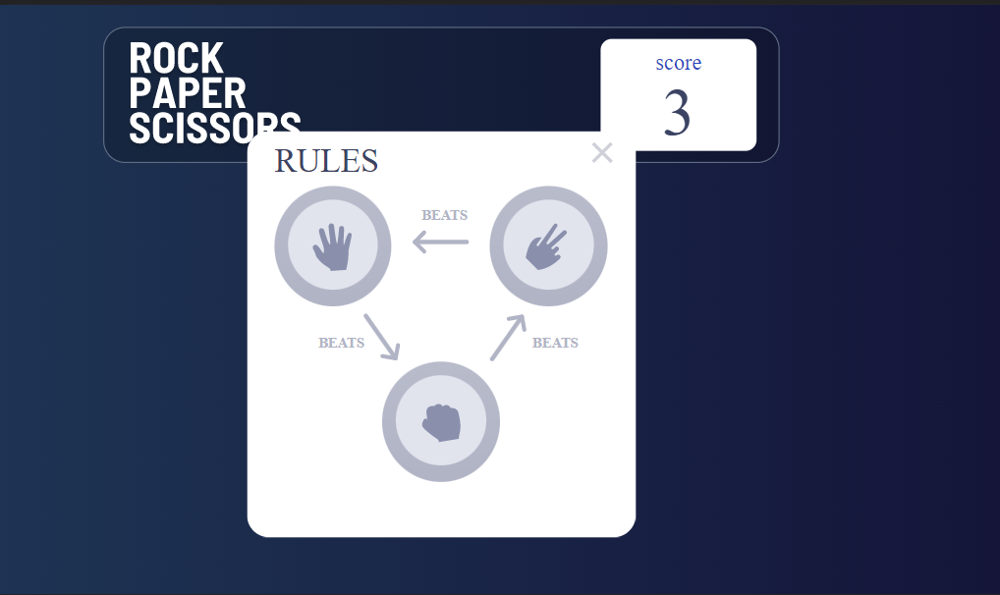
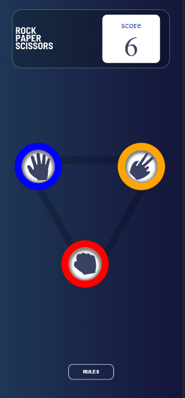
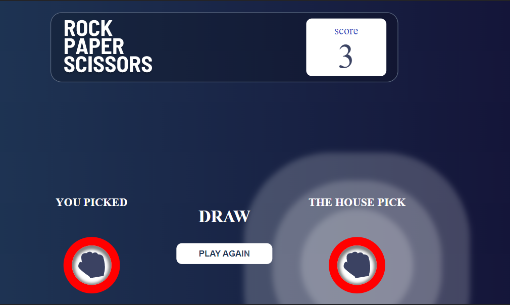
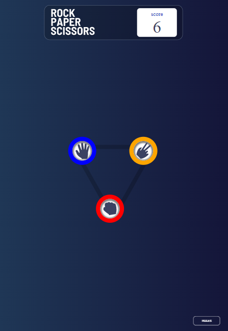
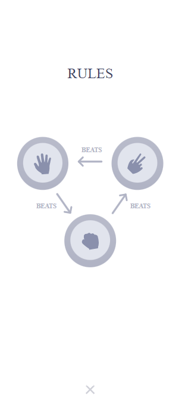

# Frontend Mentor - Rock, Paper, Scissors solution

This is a solution to the [Rock, Paper, Scissors challenge on Frontend Mentor](https://www.frontendmentor.io/challenges/rock-paper-scissors-game-pTgwgvgH). Frontend Mentor challenges help you improve your coding skills by building realistic projects. 

## Table of contents

- [Overview](#overview)
  - [The challenge](#the-challenge)
  - [Screenshot](#screenshot)
- [My process](#my-process)
  - [Built with](#built-with)
  - [What I learned](#what-i-learned)
- [Author](#author)
- [Setup](#setup)

**Note: Delete this note and update the table of contents based on what sections you keep.**

## Overview

### The challenge

Users should be able to:

- View the optimal layout for the game depending on their device's screen size
- Play Rock, Paper, Scissors against the computer
- Maintain the state of the score after refreshing the browser _(optional)_

### Screenshot

## My process

### Built with

- Semantic HTML5 markup
- CSS custom properties
- Flexbox
- CSS Grid
- Desktop-first workflow
- [React](https://reactjs.org/) - JS library

### What I learned
- During this challenge i learnt more about using the react state
- I learnt about using the react function componentDidMount as I used it in implementing a delay
- Got to understand how to store values in the local storage
- Figured different ways to manipulate svg

## Author
- Frontend Mentor - [@martinnkemakolam](https://www.frontendmentor.io/profile/@martinnkemakolam)
- Twitter - [@MartinNkemakol1](https://www.twitter.com/@MartinNkemakol1)

## Setup
- Download the file
- Open with VScode or any IDE of your choice 
- Run npm start on the terminal
- play and have fun

